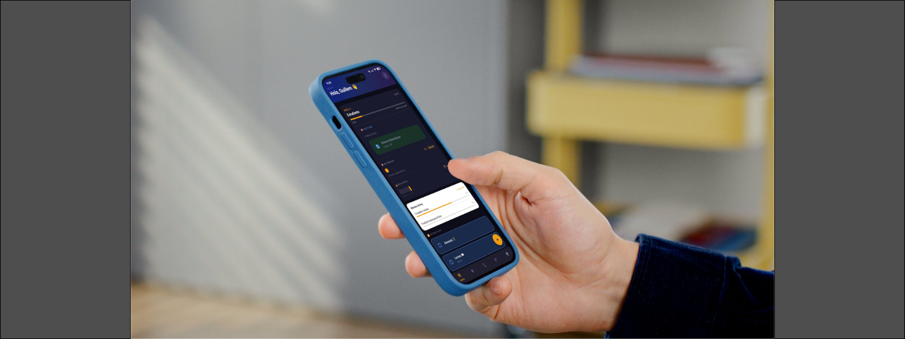
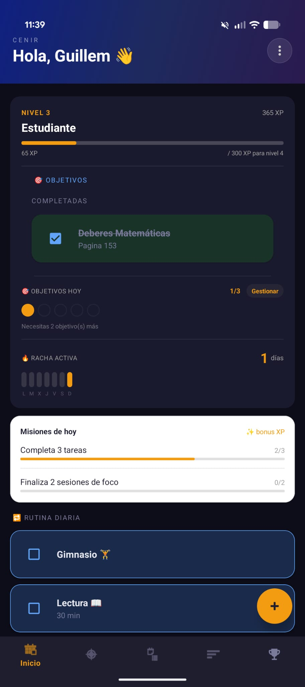
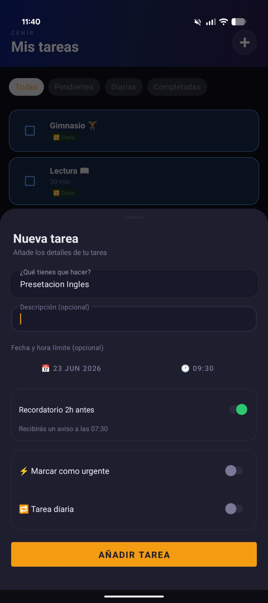
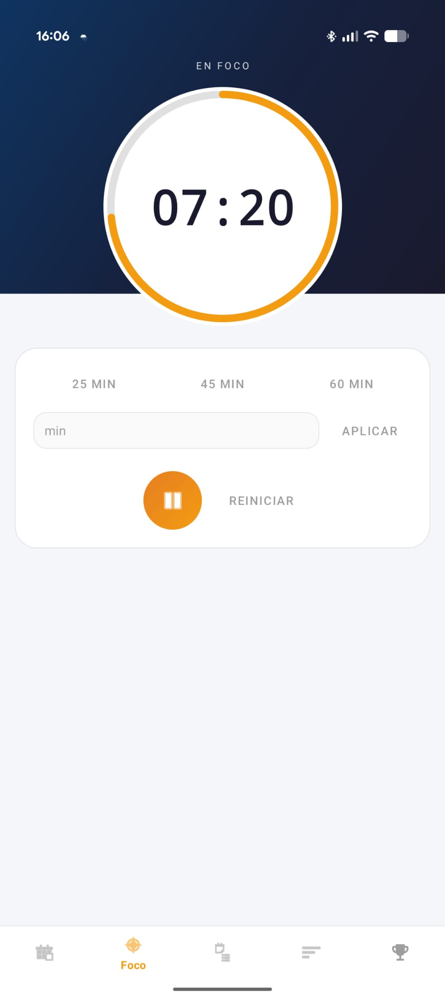
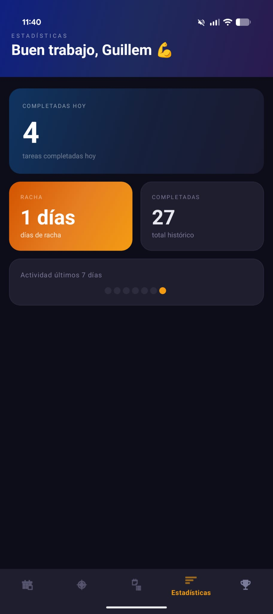
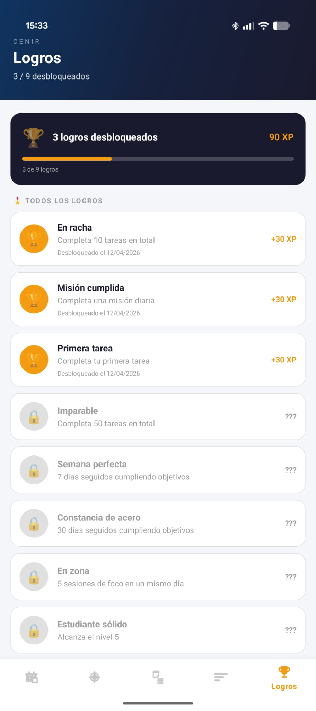

<p align="center">
  
</p>


# CenirApp

A modern Android productivity application that combines task management with gamification to encourage consistency, focus and daily progress.

CenirApp transforms productivity into an engaging experience by rewarding users with experience points, levels, achievements and daily missions while helping them organize their study and work sessions.

---

## Overview

CenirApp was developed as a personal project to explore modern Android development using Kotlin and the MVVM architecture.

The application focuses on three main areas:

* Task management
* Focus sessions (Pomodoro)
* Gamification

All user data is stored locally using Room, while background tasks and reminders are managed with WorkManager.

---

## Screenshots

<p align="center">
  
  
</p>

<p align="center">
  
  
</p>

<p align="center">
  
</p>
---

## Features

### Productivity

* Create and manage tasks
* Daily objectives
* Daily recurring tasks
* Due dates and reminders
* Task filtering
* Priority management

### Focus Mode

* Customizable Pomodoro timer
* Focus session tracking
* Circular animated timer
* Session rewards
* Custom session duration

### Gamification

* Experience (XP) system
* Level progression
* Daily missions
* Achievement system
* Daily streaks
* Progress tracking

### Statistics

* Daily completed tasks
* Weekly activity
* Total completed tasks
* Current streak
* User progression

### Notifications

* Daily mission reminders
* Task reminders
* Streak notifications
* Focus session completion
* Automatic daily reset

---

## Technology Stack

| Category         | Technology                |
| ---------------- | ------------------------- |
| Language         | Kotlin                    |
| Architecture     | MVVM                      |
| Database         | Room (SQLite)             |
| UI               | XML + Material Components |
| Background Tasks | WorkManager               |
| Reactive Data    | LiveData & Flow           |
| Concurrency      | Kotlin Coroutines         |
| IDE              | Android Studio            |

---

## Architecture

The project follows the MVVM (Model–View–ViewModel) architecture to separate business logic from the user interface.

```text
Presentation
│
├── Activities
├── Fragments
└── ViewModels
        │
        ▼
Business Logic
│
├── Gamification Manager
├── Level System
└── Daily Missions
        │
        ▼
Data Layer
│
├── Room Database
├── DAO
└── Entities
```

---

## Key Components

* Room Database
* ViewModels
* LiveData
* Kotlin Flow
* WorkManager
* Custom Timer View
* Material Design Components

---

## Future Improvements

* Cloud synchronization
* User authentication
* Task editing
* DataStore preferences
* Dependency Injection (Hilt)
* Jetpack Navigation
* Jetpack Compose migration
* Unit testing
* Accessibility improvements
* Multi-language support

---

## Learning Objectives

This project was developed to strengthen my knowledge of:

* Android application development
* Software architecture
* Local data persistence
* Background processing
* UI/UX design
* Clean code principles
* Kotlin best practices

---

## Author

**Guillem Clua**

Software Developer Student

GitHub: https://github.com/Guillem-ctrl
